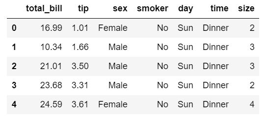
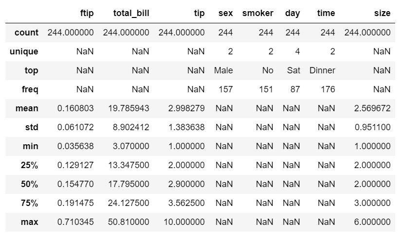
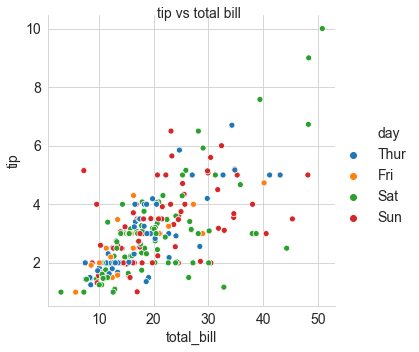
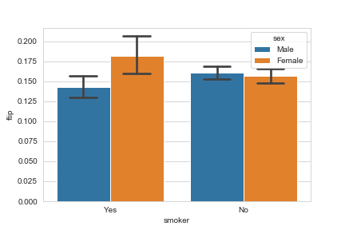
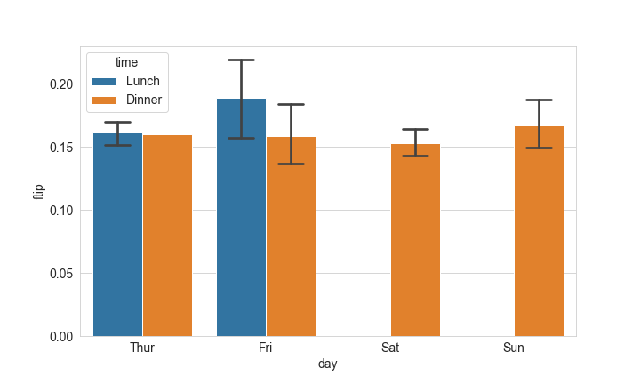
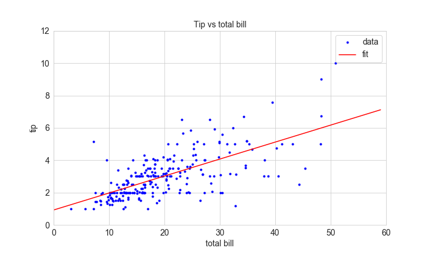

# The Tips Data Set 
## Elizabeth Daly

### HDip Data Analytics 2019 
### 52446 Fundamentals of Data Analysis Assessment

Git-hub repository at:
https://github.com/elizabethdaly/data-analysis-project.git

- Jupyter notebook: **tips-data-analysis.ipynb**
- Dataset: data\tips.csv

# Table of contents
1. [Introduction](#introduction)

2. [Description of the data set](#section2)

3. [Regression](#section3)
    1. [Regression in Seaborn](#sec3p1)
    2. [Simple linear regression using polyfit](#sec3p2)
    3. [Regression with Statsmodels](#sec3.3)
    4. [Regression with scikit-learn](#sec3p4)
    5. [Linear regression on various subsets of the data](#sec3.5)
    
4. [Relationships between variables](#section4)
    1. [Visualize relationships between numerical variables with pairplot](#sec4p1)
    2. [Investigate relationships between tip amount and the categorical variables](#sec4p2)
    3. [Does the amount spent depend on party size?](#sec4p3)
    4. [Next section](#sec4p4)
    
5. [Work done by other people on the Tips data set](#section5)
    
6. [Conclusion](#conclusion)

9. [References](#references)

## 1. Introduction 
- This README describes work done on the Tips data set for the Fundamentals of Data Analysis module assessment due 29 November 2019. Resources used include Python and associated packages Jupyter, matplotlib, Seaborn, scikit-learn, statsmodels, and SciPy. 
- The analysis takes the form of a single Jupyter notebook of filename given above. To view this file, download it from this repository and start Jupyter notebook from the folder containing the file. Jupyter notebook comes as part of the Anaconda distribution of Python (as do the other packages listed above). 
- Alternatively, view a static version of the notebook (by providing its GitHub url) using Jupyter Nbviewer. 
- The Tips data set is included in the Seaborn visualization library. It can be loaded provided one has access to the internet when running the notebook. For the sake of completeness, I have downloaded the data set from the site referenced in the project instructions, and I include it in this repository as a csv file. It is located in the **data** subdirectory.
- All images intended for inclusion in this README are located in the **images** subdirectory of this repository.
- I have tried to structure the Jupyter notebook and this README so that they have corresponding sections. However, I do not wish to merely repeat here what has been stated in the notebook. I will endeavour to have this README summarize the work of the notebook and, hopefully, complement the analyses done there.

##  2. Description of the data set 
The data in the tips dataset was gathered over a two and a half month period in early 1990. It contains 244 rows of data relating to tips left in a restaurant. I will assume that the currency is $, as I think this is an American data set. Information within includes the total bill, tip, number in the party, day of week, time of day, gender of the diner, and whether or not they are a smoker. I would say that the basic question is: does the tip amount depend on the total bill? One can also ask if the other variables influence the tip amount. Some of these questions will be addressed in sections 3 and 4.

I often use sites such as Medium.com to see how other people have investigated data sets using Python. Two examples of such exploratory data analyses are given in the reference list. The very first step is always to check if the data needs cleaning by looking for duplicate rows, zero values or NaNs where they shouldn't be, etc. Our data set is small enough to inspect visually and it looks fine. Counting the number of valid entries in each column confirms this. The head of the data set looks like:

Pandas **describe()** can provide a quick summary of the data set as outlined in the notebook. However, without looking at the data in more detail, we cannot yet state what we think a typical diner is. What I mean is, just because most of the diners are male, smokers, and eating dinner on Saturday when we consider one variable at a time, that doesn't mean that all of these conditions are met simultaneously. In the notebook I calculate the tip as a fraction of the total bill as I think it's a measure of tip size that we are more familiar with. That is also done in the https://devarea.com/ reference below, in Wes McKinney's book when he is using the Tips data set as an example, and in the *Case Study 1: Restaurant Tipping* report also below. So it seems like a sensible step to take.

From this summary we can say that:
1. The average tip (as a fraction of total bill) is about 16%.
2. There is an outlier in the data set: a male smoker at dinner on Sunday in party size of 2, left a 71% tip. 
3. The lowest tip rate was also left by a male smoker at dinner in a party size of 2, but on Saturday; 3.6%. 
3. The 50th percentile is very similar to the mean, so the mean tip is a typical value in the data set.
4. More males than females paid the bill, 157 of the 244 observations.
5. More non-smokers than smokers paid the bill, 151 of the 244 observations.
6. Most of the observations relate to Saturday, 87 of the 244.
7. Most of the observations relate to dinner, 176 of the 244.
8. Party size varied from 1 to 6, with the average size being 2.5.

This is what a plot of tip versus total bill looks like. Here, data from each day is plotted in a different colour, but the same could also be done for any of the other categorical variables sex, smoker, and time.

We can use Pandas **groupby()** to get more detailed information about tipping behaviour for each category of diner. From this part of the notebook, we can conclude that:
1. It seems that non-smokers, regardless of their sex, leave similar tips (about 16%).
2. On the other hand, for smokers, females leave higher tips than males on average (18% versus 15%).
3. The most frequently-occurring party size is 2 (156 of the total), followed by 3 (38), and 4 (37). There are only a handful of observations related to party sizes of 1, 5, and 6.
4. The data set only contains information about dinner on Saturday (87 out of 244) and Sunday (76). There is one dinner observation on Thursday, the rest are lunch (61). Friday has lunch and dinner recorded, but overall numbers are small (19 in total).
5. The highest average tip (as a fraction of total bill) is left at lunch on Fridays.
6. The lowest average tip (as a fraction of total bill) is left at dinner on Saturdays.

The following plots summarize this information. So far it looks like the best time to be waiter in this restaurant is at lunch on Fridays.

##  3. Regression 
For this part of the assessment, we have been asked to analyse if there is a relationship between the total bill and the tip amount. The simplest relationship would be a linear one. That's reasonable when we consider that tips (especially in the US) are usually a fixed percentage of the total bill. 

### 3.1 Regression in Seaborn 
In the notebook we first use Seaborn to visualize any linear relationships between our two variables of interest using Seaborn **regplot**. This does not give us any fitting parameters such as the slope and intercept of the linear fit, or any metrics to assess the quality of the fit, but it's a good start. 

### 3.2 Simple linear regression using polyfit 
We perform a simple linear regression analysis of the data as per the week 9 lectures for this module. **numpy.polyfit** can calculate the slope and intercept of the best fit line based on least squares fitting. It doesn't directly return a metric, so we must use **numpy.corrcoef** to evaluate the strength of the linear relationship between the total bill and tip amount. This function returns a matrix from which we can calculate the R2 value as explained in the reference below about Pearson and Spearman Correlation in Python. The fitting parameters for our linear model are: 
- slope = 0.105
- intercept = 0.920
- R2 = 0.457

So, a linear relationship does exist between the total bill and the tip amount, but it's not a very strong one. I'll discuss that more below.

### 3.3 Regression with Statsmodels 
We then move on to using two packages, Statsmodels and scikit-learn, to perform linear regression and return fitting parameters and metrics. Statsmodels is a Python package for performing statistical analysis of data - we are interested in the OLS (Ordinary Least Squares) module for performing linear regression. OLS involves fitting a linear model with coefficients to minimize the residual sum of squares between the observed data points and the best fit. 

### 3.4 Regression with scikit-learn 
Scikit-learn is a machine learning package which can also perform OLS fitting. Strictly speaking there is no need to perform regression with both packages, but I do it once in the notebook and then stick to scikit-learn, which is useful for making predictions using the dataset. 

In regression, R2 is the coefficient of determination, a measure of how close the data points are to the fitted regression line; or how much of the variation in the data is explained by the linear model. It ranges from 0 to 1, and in general, higher values of R2 are better. However, as the minitab reference below discusses, that's not the full story. That reference states that in fields which try to predict human behaviour (the tips dataset falls into this category), values of R2 less that 0.5 are not unusual; we find R2 = 0.457 on average. It's also important to take into account the appropriateness of the model when assessing R2. Another model (perhaps a high-order polynomial fit)may produce a better R2 but wouldn't be a sensible way to model how tip amount varies with total bill. 

To conclude this part of the analysis: the tip does depend linearly on the total bill in this dataset. The slope of the best fit line is 0.105, the y intercept is 0.920, and R2 is 0.457.

### 3.5 Linear regression on various subsets of the data 
The results of regression on all of the data, and on subsets of it, are presented in the table below.

Line fit    | R2 | slope | intercept
------------|---------------|-------|----------
All           | 0.457     | 0.105 | 0.920     |
size = 2      | 0.232     | 0.078 | 1.292     |
size = 2,3,4  | 0.438     | 0.105 | 0.920     |
F smokers     | 0.266     | 0.068 | 1.701     |
M smokers     | 0.232     | 0.073 | 1.425     |
F non-smokers | 0.686     | 0.128 | 0.452     |
M non-smokers | 0.670     | 0.140 | 0.348     |
day = Thur    | 0.660     | 0.128 | 0.512     |
day = Fri     | 0.597     | 0.095 | 1.109     |
day = Sat     | 0.495     | 0.121 | 0.519     |
day = Sun     | 0.251     | 0.070 | 1.753     |

What can we conclude from this? If higher R2 indicates better a fit, then the data is fitted well by a linear model for non-smokers (regardless of sex) and for day = Thursday; these subsets result in the largest R2 values and also high slopes. Maybe considering data from non-smokers on Thursday would produce the most reliable predictions of tip given total bill?

We can use our linear regression parameters to **predict** the tip amount for any total bill, say a bill of $100. 
- Using all of the data, we predict a tip of $11.42 for this total bill amount;
- For male non-smokers only, we predict a tip of $14.32;
- Considering data from Thursday alone, we predict a tip of $13.29;
- In contrast, Sunday data predicts just $8.77 as a tip.

As the average total bill in this restaurant is just less than $20 and the maximum is about $50 it's unlikely that anyone would ever spend $100 here in the first place!

## 4. Relationships between variables 
We have investigated if the tip amount is related to the total bill, and we have explored a little how that relationship is different depending on the subsets of data used. We now want to analyse other relationships between the variables of the dataset.   

### 4.1 Visualize relationships between numerical variables with pairplot 
- Suggests a relationship between tip and total bill. Done in part 3.

### 4.2 Investigate relationships between tip amount and the categorical variables 
- Maybe pivot_table()

### 4.3 Does the amount spent depend on party size? 
- per person bill & tip with fits

### 4.4 Next section 
<!--ML predict classify-->

<!--Questions-->

## 5. Work done by other people on the Tips data set 
The tips data set is often used to illustrate the capabilities of Seaborn, so it appears a lot in the documentation for that package. Some examples are listed in the references below. I also found an anonymous report from Iowa State University on the tips data state which is referenced below. It seems to be a report for a statistics class but with a business bias. There is no code in the report (indeed I don't know what application was used to perform the analysis), but I'm guessing a pure statistics package as there is mention of t-values and p-values. 
Regression using all cat vars.
Others..brief discussion here.

## 6. Conclusions 
Main findings:
1. one
2. two
3. three
4. etc

## 7. References 

**General:**

- [1]  Anaconda Distribution
https://www.anaconda.com/

- [2] Python Software Foundation
https://www.python.org/

- [3] Project Jupyter
https://jupyter.org/

- [4] Sharing Jupyter notebooks
https://nbviewer.jupyter.org/

- [5] seaborn: statistical data visualization
https://seaborn.pydata.org/index.html#

- [6] matplotlib: Python plotting library
https://matplotlib.org/

- [7] The Tips dataset from Michael Waskom
https://github.com/mwaskom/seaborn-data/blob/master/tips.csv

- [8] Description of what is contained in the tips set
https://www.kaggle.com/ranjeetjain3/seaborn-tips-dataset

- [] scikit-learn: Machine Learning in Python
https://scikit-learn.org/stable/index.html

- [] StatsModels: Statistics in Python
https://www.statsmodels.org/stable/index.html

- [] scipy.stats : Statistics with SciPy
https://docs.scipy.org/doc/scipy/reference/tutorial/stats.html

**Exploratory data analysis:**

- [] Exploratory Statistical Data Analysis with a Real Dataset using Pandas
https://towardsdatascience.com/exploratory-statistical-data-analysis-with-a-real-dataset-using-pandas-208007798b92

- [9] How to investigate a data set with Python
https://towardsdatascience.com/hitchhikers-guide-to-exploratory-data-analysis-6e8d896d3f7e

- [10] Data analysis with Python
https://medium.com/@onpillow/01-investigate-tmdb-movie-dataset-python-data-analysis-project-part-1-data-wrangling-3d2b55ea7714

- [11] Python for Data Analysis: Data Wrangling with Pandas, NumPy, and IPython. 
Wes McKinney. ISBN-13: 978-1491957660 ISBN-10: 1491957662

- [12] Pandas In 10 Minutes || Wes McKinney
https://www.youtube.com/watch?v=1MGCD8SQp3k

- [13] Good description of quartiles on Seaborn plots
https://towardsdatascience.com/analyze-the-data-through-data-visualization-using-seaborn-255e1cd3948e

**Regression:**

- [14] Ordinary Least Squares in statsmodels
https://www.statsmodels.org/dev/examples/notebooks/generated/ols.html

- [15] Generalized Linear Models in scikit-learn
https://scikit-learn.org/stable/modules/linear_model.html#ordinary-least-squares

- [16] How to run Linear regression in Python scikit-Learn
https://bigdata-madesimple.com/how-to-run-linear-regression-in-python-scikit-learn/

- [17] A beginner’s guide to Linear Regression in Python with Scikit-Learn
https://towardsdatascience.com/a-beginners-guide-to-linear-regression-in-python-with-scikit-learn-83a8f7ae2b4f

- [18] Regression Analysis: How Do I Interpret R-squared and Assess the Goodness-of-Fit?
https://blog.minitab.com/blog/adventures-in-statistics-2/regression-analysis-how-do-i-interpret-r-squared-and-assess-the-goodness-of-fit

- [] Python and R Tips To Learn Data Science: Pearson and Spearman Correlation in Python
https://cmdlinetips.com/2019/08/how-to-compute-pearson-and-spearman-correlation-in-python/

**Classification:**

-[] K-nearest Neighbors (KNN) Classification Model
https://www.ritchieng.com/machine-learning-k-nearest-neighbors-knn/

**References directly relating to Tips:**

- [19] Tips data set in PYTHON MACHINE LEARNING EXAMPLE – LINEAR REGRESSION
https://devarea.com/python-machine-learning-example-linear-regression/#.XbbfgOj7Q2w

- [] Tips analysis using Seaborn: Visualizing statistical relationships
https://seaborn.pydata.org/tutorial/relational.html#relational-tutorial

- [] Tips analysis using Seaborn: Plotting with categorical data
https://seaborn.pydata.org/tutorial/categorical.html#categorical-tutorial

- [] Tips analysis using Seaborn: Visualizing linear relationships
https://seaborn.pydata.org/tutorial/regression.html#regression-tutorial

- [] Tips analysis using Seaborn: Building structured multi-plot grids
https://seaborn.pydata.org/tutorial/axis_grids.html#grid-tutorial

- [20] STAT 503 Case Study 1: Restaurant Tipping (Author unknown)
https://dicook.public.iastate.edu/stat503/05/cs-tips2.pdf

- [] Interactive analytics and predictions on Restaurant tips
https://medium.com/@valentinaalto/interactive-analytics-and-predictions-on-restaurant-tips-94f21f537de8

- [] Seaborn again: Python Data Visualisation using Seaborn 
https://grindsquare.co.za/python-data-visualisation-using-seaborn/

- [] Excerpt from the Python Data Science Handbook by Jake VanderPlas; Jupyter notebooks are available on GitHub.
https://jakevdp.github.io/PythonDataScienceHandbook/04.14-visualization-with-seaborn.html

- [] Interactive analytics and predictions on Restaurant tips
https://datasciencechalktalk.com/2019/11/03/interactive-analytics-and-predictions-on-restaurant-tips/